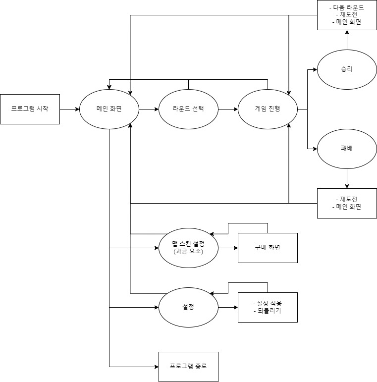

# 게임 기획서

## 1. 게임 제목

* 게임을 상징적으로 잘 설명할 수 있는 제목을 함축적으로 작성한다.

> Two Arms Cactus


## 2. 기획의도

* 해당 게임을 왜 기획하게 되었는지에 대한 내용을 기재한다. 
* 게임 제작 동기와 타당성을 부여해준다.

```txt
어지럼증 유발, 안전 확보 등의 이유로 VR 기기를 착용한 상태에서의 움직임은 제한된다.
또한 움직임을 구현하더라도 사람의 발의 움직임을 감지할 수는 없기 때문에 VR 기기의 버튼을 통해 조작한다.
그러한 단점을 극복하여 안전하면서도 게임 내에서 생동감있는 움직임을 구현해보고 싶었다.

먼저, 어떤 게임을 만들지 고민하면서 완전히 새로운 게임을 찾기보다는 직접 플레이 해봤던 게임들 중에서 아이디어를 얻어 만드는 것이 좋다고 생각했고, 결과적으로 바이페드(Biped)라는 게임에서 큰 아이디어를 얻었다.

바이페드는 두개의 발만을 가진 캐릭터가 양 발을 조작하며 이동하고 손의 역할도 하여 미션을 완수해나가는 게임이다. 바이페드의 조작은 양 발을 바닥으로 향하여 걷는 모션을 취하면 걷고, 앞으로 내밀어 클릭하면 엔티티와 상호작용하게 된다. 즉 손과 발의 구분을 없앤 게임이다. 이것은 손의 움직임과 손을 통한 조작만을 취할 수 있는 VR 게임의 단점을 극복할 수 있을 것이라 보았다.
```
[바이페드 트레일러 영상 링크](https://www.youtube.com/watch?v=smlef-jkmuQ)


## 3. 주요 플랫폼 (시스템 사양)
* 게임을 플레이하기 위해 갖추어야 할 시스템과 최소사양, 권장 사양을 기재한다.

```txt
현재 만들고자 하는 게임은 작은 사이즈의 에셋을 활용하여 만들 예정이므로, 높은 사양의 시스템을 요구하지는 않을 것으로 보인다.
그러나 정확한 시스템 사양 파악을 위해 아이디어를 얻었던 바이패드, 휴먼: 폴 플랫(Human: Fall Flat), 언래블2(Unravel Two) 등의 사양과 비교하여 절충안의 사양을 도출해 보았다.

최소 사양
64비트 프로세서와 운영 체제가 필요합니다
프로세서: Intel i3 2120 @ 3.3GHz OR AMD FX 4350 @ 4.2 GHz
메모리: 4 GB RAM
그래픽: NVIDIA GeForce GTX 660
저장공간: 8 GB 사용 가능 공간
추가 사항: VR 기기

권장 사양
64비트 프로세서와 운영 체제가 필요합니다
프로세서: Intel i5 2300 @ 2.8GHz OR AMD FX 6100 @ 3.3 GHz
메모리: 8 GB RAM
그래픽: NVIDIA GeForce GTX 960
저장공간: 8 GB 사용 가능 공간
추가 사항: VR 기기

```


## 4. 이용 대상자 (주요소비층)
* 게임을 주로 이용할 타깃 사용자층을 기재한다.

```
아기자기한 캐릭터를 조작하여 미션 및 퍼즐을 풀어나가는 게임으로, 폭력성 · 선정성 · 약물성 · 사행성 등의 게임물관리위원회에서 분류한 등급분류세부기준에 해당되는 요소가 없어 컨텐츠적 요소로서는 소비층의 제한이 크게 요구되지 않는다.

다만, VR 기기를 사용함에 있어 만 13세 미만 이동의 경우 신체적/정신적 미성숙 등을 이유로 장애를 초래할 수 있으므로, 만 13세 이상의 사용자층을 주요 소비층으로 설정하였다.
```


## 5. 게임의 특징(차별화 요소)
* 타 게임과 확연히 드러나는 차이점을 설명할 수 있어야 한다.

```
우리는 손의 VR 기기를 통해 움직임을 제어하기 때문에 우리는 양 손으로 물건 등과 상호작용을 하며 동시에 발의 역할도 하게된다.

차별화: 바이페드를 VR에 접목 시키면서 발생하는 문제를 극복하면서 가지게 될 본 게임의 특징점을 차별화 요소로 만들것이다.

먼저, 바이페드를 VR로 접목하였을때 예상되는 문제점은 다음과 같다.
```

1. 일반적으로 엑스박스의 엑스박스 컨트롤러(Xbox controller), 플레이스테이션의 듀얼쇼크(DUALSHOCK)와 같은 게임패드를 통해 조작하는 바이패드는 제자리에서 한 방향으로 무한정 돌 수 있다. 그러나 VR기기를 착용한 사용자가 한 방향으로 계속 돌 수 없으며, 돌게 되더라도 어지럼증을 유발할 가능성이 존재한다.

2. 바이페드는 기본적으로 2인용 게임이므로 친구와의 협동 플레이를 통한 재미 요소가 부각 된다. 그러나 우리가 만들고자 하는 게임은 1인용이므로 다른 재미 요소를 추가해야 한다.

3. 바이페드는 2인 협동 플레이의 요소를 살리기 위하여 한 플레이어가 물건을 잡거나 버튼을 누르고 있으면 움직일 수 없고, 그 동안 친구가 다른 위치에서 문제를 해결하는 등의 행동을 하게된다. 이러한 요소를 그대로 가져왔을 때 1인 플레이인 본 게임에서는 플레이어가 미션을 수행 할 수 없게된다.

```
이러한 문제를 해결하기 위해 본 게임에서는 다음과 같은 해결책을 제시하였고, 이 부분이 타 게임과는 차별화되는 요소가 된다.
```

1. 제자리에서 계속 회전하는 경우를 방지하기 앞뒤좌우를 반복해서 바라보아야 하는 미션은 본 게임에서 고려하지 않았다.

2. 2인 플레이를 통한 협동 요소가 사라지는 대신 휴먼: 폴 플랫(Human: Fall Flat)이라는 게임에서 아이디어를 얻어 각종 퍼즐 요소를 추가하였다.

3. 1인 플레이이므로 다른 위치에서 동시에 미션을 수행할 수 없다는 문제를 해결하기 위해 언래블2(Unravel Two)라는 게임에서 아이디어를 얻었다. 언래블2는 손에서 밧줄을 뻗어 먼 곳의 물건을 잡거나 밧줄을 높은곳으로 뻗어 고정시킨 후 높은 곳으로 올라갈 수 있다. 본 게임에서는 손에서 밧줄과 같은 요소를 뻗어 멀리있는 요소와 상호작용할 수 있도록 한다.


## 6. 세계관 및 줄거리 설정 (필수 아님)
* 스토리가 주컨텐츠인 게임은 간단한 설정을 한다. 

```
주인공 캑터스는 같은 동네(그린 플래닛)에 사는 친구들(머쉬룸 친구들)과는 다른 외모로 인해 소외받는다.
캑터스는 친구를 사귀기 위해 머쉬룸 친구들이 요청하는 도움(미션)을 클리어하며 친구를 한명한명 사귀어나간다.
```


## 7. 주요 캐릭터 및 배경 설정(이미지 포함)
* 게임에 등장하는 핵심 캐릭터에 대해 간략하게 설정한다. 
* 중요도가 높은 대상만 설정한다.

```
캑터스(주인공): 선인장 모습의 캐릭터이다. 사용자는 캑터스가 되어 플레이하며, 머쉬룸 친구들과는 다른 외모로 인해 소외받고 있다.

머쉬룸 친구들: 그린 플래닛에 사는 버섯 모습의 npc들이다.
```


## 8. 게임 기본 구성
* 게임의 기본적인 룰(클리어 조건, 레벨 디자인), 조작방법, 기본화면 구성(와이어 프레임, 스토리보드 등) 등에 대해  기재한다.

```
게임의 룰은 게임 진행 과정에서 npc가 요구하는 미션을 수행하고, 퍼즐을 풀어 목적지까지 도달하면 해당 레벨을 클리어 할 수 있다.

조작 방법은 팔을 아래로 하여 움직이면 캐릭터는 땅을 짚으며 앞으로 나가간다. 또한 팔을 게임의 요소를 향해 뻗어 컨트롤러의 버튼을 클릭하면 상호작용할 수 있다. 또한, 멀리 있는 요소는 컨트롤러의 다른 버튼을 통해 상호작용 할 수 있으며, 양 손의 컨트롤러의 버튼을 동시에 눌러 부스터를 사용할 수 있다.
```


## 9. 콘텐츠 구성
* 콘텐츠의 전체 흐름을 기재한 순환구조도, 콘텐츠의 종류에 대해 기재한다.
* 그래픽, 사운드, UI-UX  

> 순환구조도
>
>

## 10. 개발일정(9주~14주)